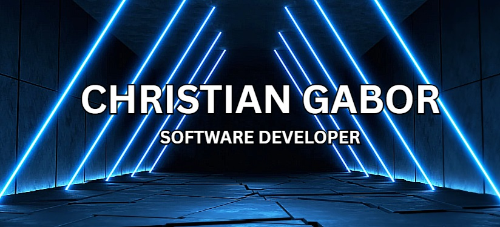

  

<h4 align="center">I'm Christian, software development technician. Here you would find my projects for college and personal too. I've used Angular as a framework for frontend and Nodejs for backend. Used relational (SQL) and not relational (MongoDB) databases. And also all of this in the cloud with Amazon AWS Services. I'm currently learning Python in full.  
💻Workflow: Git, Github, Gitlab, BitBucket
 
💻SO: Windows
</h4>

    

