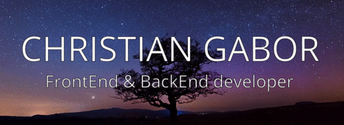

  

<h3 align="center">Soy Christian, ya a mediados de la carrera de Ing. en sistemas.</h3>
<h4 align="center">Soy un programador junior y podran ver mis proyectos tanto de la facultad como propios en este github en lenguajes como: C, C#, Javascript, Python, HTML+CSS, etc. 
  Mi pagina en proceso: https://chrisngdc.github.io/  
💻Workflow: Git, Github
 
💻SO: Windows
</h4>

    

